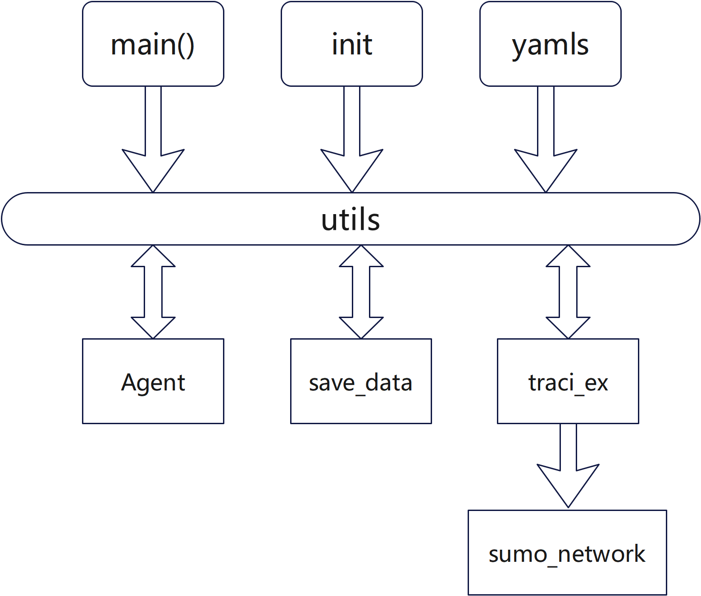

# Deep Reinforcement Learning for Traffic Signal Optimization

## Introduction to DRL in Traffic Signal Control Optimization

Deep Reinforcement Learning (DRL) has emerged as a powerful technique for optimizing various real-world systems. In the realm of traffic engineering, DRL has shown great promise in enhancing traffic signal control. By leveraging the capabilities of deep neural networks and reinforcement learning, DRL agents can learn to make optimal decisions in complex and dynamic traffic environments.

### The Challenges of Traditional Traffic Signal Control

Traditional traffic signal control methods often rely on fixed-time or adaptive control strategies. These methods can be suboptimal in handling varying traffic conditions, especially during peak hours or in the presence of unexpected events.

### The Advantages of DRL in Traffic Signal Control
- Adaptive Control: DRL agents can learn to adapt their control strategies based on real-time traffic conditions, ensuring efficient signal timing.
- Complex Environments: DRL can handle the complexity of urban traffic networks, considering factors such as multiple intersections, varying traffic volumes, and pedestrian crossings.
- Continuous Optimization: DRL allows for continuous improvement of control policies, as agents learn from experience and refine their decision-making process.
- Real-time Decision Making: DRL agents can make decisions in real-time, responding quickly to changes in traffic conditions.

### DRL Framework for Traffic Signal Control

A typical DRL framework for traffic signal control involves the following components:

- State Representation: The agent's state is defined based on the current traffic conditions, such as queue lengths, occupancy rates, and vehicle counts.
- Action Space: The agent's actions are the possible signal timings or phase sequences.
- Reward Function: The reward function defines the goal of the agent. In traffic signal control, it could be minimizing congestion, reducing travel time, or improving fuel efficiency.
- Deep Neural Network: A deep neural network is used to approximate the value function or policy function, which guides the agent's decision-making.
- Reinforcement Learning Algorithm: A reinforcement learning algorithm, such as Q-learning or the Deep Q-Network (DQN), is employed to update the agent's policy based on its experiences.

### Conclusion
DRL offers a promising approach to addressing the challenges of traditional traffic signal control. By leveraging the power of deep learning and reinforcement learning, DRL agents can learn to make intelligent decisions in complex traffic environments, leading to improved traffic efficiency and reduced congestion. As research and development in DRL continue to advance, we can expect to see even more innovative applications in the field of traffic management.

## Fundamental Architecture 

- main(): The entry point of the program, likely responsible for initiating other modules and controlling the overall flow.
- init: used for initializing variables, settings, or connections.
- yamls: related to configuration files, perhaps using YAML format for storing settings.
- utils: A utility module, likely providing common functions or tools used by other modules.
-  Agent: related to an agent or entity within the program, such as an AI or a simulated agent.
- save_data: A module for saving data generated by the program.
- traci_ex: a module related to the TraCI (Traffic Control Interface) for SUMO, a traffic simulation software.
- sumo_network: represents the network or environment used in a SUMO simulation.

## 1. [Q-Learning with Epsilon Greedy](./QL-epsilon_greedy/readme.md)

- [source code](QL-epsilon_greedy/)

## 2. [SARSA with UCB](SARSA_UCB/readme.md)

## 3. [Actor-Critic(AC) with boltzmann](Actor-Critic(AC)_boltzmann/readme.md)

## 4. [A3C](A3C/readme.md)

## 5. [NatureDQN-DNN](NatureDQN-DNN/readme.md)

## 6. [DDQN-DNN](DDQN-DNN/readme.md)

## 7. [DuelingDQN-DNN](DuelingDQN-DNN/readme.md)

## 8. [DuelingDDQN-DNN(D3QN)](DuelingDDQN-DNN(D3QN)/readme.md)

## 9. [DDPG](DDPG/readme.md)

## 10. [Nash-QL](Nash-QL/readme.md)

## 11. [Nash-DQN](Nash-DQN/readme.md)

## 12. [Nash-DuelingDQN](Nash-DuelingDQN/readme.md)

## 13. [NSHG-QL](NSHG-QL/readme.md)

## 14. [NSHG-DQN](NSHG-DQN/readme.md)

## 15. [MFQ-MLP](MFQ-MLP/readme.md)

